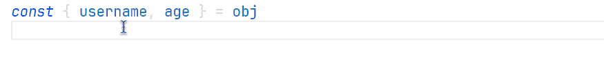

# Debugger for Console
轻松生成各种语言的控制台调试语句（甚至是 debugger）。

This document is also available in [English](./README-CN.md).

## BREAKING CHANGE
从0.11.0版本开始，将占位符变量替换为{VALUE}而不是$。

## Why not [Turbo Console Log](https://marketplace.visualstudio.com/items?itemName=ChakrounAnas.turbo-console-log)?
首先，我必须承认它确实很棒，甚至我做这个插件的动机都是因为它，不过我的确以我的使用习惯在使用的发现了一些问题（当然这也有可能是我的使用“姿势”不对的问题😜）。

1. 虽然它可以替换 emoji，但即便可以替换所有的日志也还是只能使用同一个 emoji。
2. 如果你同时插入多个日志，它是一条一条插入的，如果你开启了自动保存的话它可能会污染你的本地保存记录，你想撤回的话需要按很多次 Ctrl+Z。
3. 它对语言的支持比较有限，如果我没搞错的话，它在同一时间只支持一种语言（我是说你手动修改创建日志语句的时候）
4. 可能有些时候我更希望用 `debugger` 来替代 `console.log`，但它不支持。
5. 在同一行创建了多个光标的时候，它会在当前行下面创建多条语句，而且和你插入光标的顺序完全无关。
6. 有的时候我希望我不想要那些乱七八糟的输出格式，我就想打印一个简单的变量，但它不支持。
7. ...

>! 我想我还是有必要再重申一遍，Turbo Console Log 这个插件也很棒，只是有些不符合我的使用习惯而已，如果你也有以上困扰的话不妨试试这个（这个劲儿大😂），反正安装一个插件又不要钱（速来白嫖）。 😇

当然如果你觉得好用的话，不妨可以给我一颗 ⭐（求你了）这是对我最大的鼓励（别逼我跪下来求你），感谢你的使用~

## 亮点
1. 如果你想你甚至可以对任何语言进行定制，只需要在配置文件中添加你的配置即可。
2. 在当前光标前面或者后面插入语句，即便光标在第一行或者最后一行。
3. 可以一次性删除所有的调试语句。
4. 一键注释和取消注释所有的调试语句。
5. 支持多光标插入调试语句。
6. 支持合并同一行的光标为一条调试语句。
7. 热更新你刚做的插件修改。(而不需要重新启动编辑器)

## 安装

这个插件现在可以在 [Visual Studio Code Marketplace](https://marketplace.visualstudio.com/items?itemName=banlify.debugger-for-console) 免费安装。

## 使用

### 快捷键
#### 在当前行下面创建调试语句
<kbd>ctrl</kbd> + <kbd>shift</kbd> + <kbd>↑(ArrowUp)</kbd>


#### 在当前行上面创建调试语句
<kbd>ctrl</kbd> + <kbd>shift</kbd> + <kbd>↓(ArrowDown)</kbd>


#### 一次性删除所有的调试语句（包括当前行的空行）
<kbd>ctrl</kbd> + <kbd>shift</kbd> + <kbd>←(Backspace)</kbd>


#### 注释所有的调试语句
<kbd>ctrl</kbd> + <kbd>shift</kbd> + <kbd>/</kbd>


#### 取消注释所有的调试语句
<kbd>ctrl</kbd> + <kbd>shift</kbd> + <kbd>u</kbd>


#### 多光标
多个光标在不同行:


多个光标在相同行:


### 命令

> \> `debugger-for-console.create`: 在当前行下面创建调试语句

> \> `debugger-for-console.before`: 在当前行上面创建调试语句

> \> `debugger-for-console.remove`: 一次性删除所有的调试语句

> \> `debugger-for-console.comment`: 注释所有的调试语句

> \> `debugger-for-console.uncomment`: 取消注释所有的调试语句

> \> `debugger-for-console.update`: 更新最新的工作区配置


## 配置项

您可以通过设置个性化您希望插入的语句。(这个插件也可以作为一个简单的代码片段工具。)

```json5
// 默认配置
{
  // 执行操作后自动保存当前文件
  "debugger-for-console.autoSave": false,

  // 指定插入语句时要使用的引号类型
  // 备注: 有些语言的字符串只能使用双引号, 比如：Go，C#，rust
  "debugger-for-console.quote": "'",

  // 是否添加 emoji 表情
  "debugger-for-console.emoji": true,

  // 设置文件的相对路径深度
  "debugger-for-console.fileDepth": 2,

  // 是否插入行号
  "debugger-for-console.lineNumber": true,

  // 是否插入当前上下文栈
  "debugger-for-console.symbols": false,

  // 把变量和提示符放在不同行输出 (如果内容很长时看起来会更方便)
  "debugger-for-console.outputNewline": false,

  // 是否只输出单个变量
  // 某些语言的日志输出方法不支持多个参数，比如：Java
  "debugger-for-console.onlyOutputVariable": "auto",

  // 是否在日志消息前/后插入空行
  "debugger-for-console.insertEmptyLine": "none",

  // 自定义不同语言的输出语句
  "debugger-for-console.wrappers": {
    "php": "var_dump({VALUE})",
    "python": "print({VALUE})",
    "rust": "println!({VALUE})",
    "go": "println({VALUE})",
    "csharp": "Console.Log({VALUE})",
    // TIPS: `javascript`, `typescript`, `javascriptreact`, `typescriptreact`, `vue`, 和 `svelte` 都使用 `javascript` 这一条配置.
    "javascript": "console.log({VALUE})",
    "default": "console.log({VALUE})"
  }
}
```

### examples

```json5
{
  "debugger-for-console.wrappers": {
    "javascript": "console.warn({VALUE})"
    // 或者
    // "javascript": "debugger"
    // "javascript": "print({VALUE})"
  }
}
```


