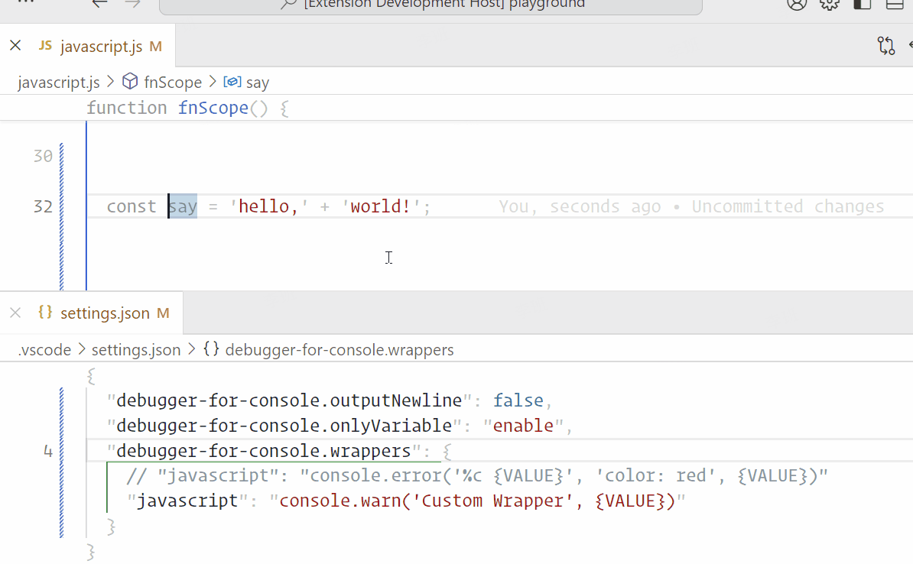

# Debugger for Console

Quickly create console debugging information for multiple languages. \
This plugin uses [antfu/starter-vscode](https://github.com/antfu/starter-vscode) as the initial template, thank you [antfu](https://github.com/antfu).

## Installing

This extension is available for free in the [Visual Studio Code Marketplace](https://marketplace.visualstudio.com/items?itemName=banlify.debugger-for-console).


## Usage

### keybindings
#### Create the statement before the line
<kbd>ctrl</kbd> + <kbd>shift</kbd> + <kbd>↑(up)</kbd>


#### Create the statement after the line
<kbd>ctrl</kbd> + <kbd>shift</kbd> + <kbd>↓(down)</kbd>


#### Remove all statements on document
<kbd>ctrl</kbd> + <kbd>shift</kbd> + <kbd>←(backspace)</kbd>


### command

\> `Insert debugger statement on before`

\> `Insert debugger statement on after`

\> `Remove all debugger statements`


## Configuration

You can customize the statements you want to insert in the Settings.(You can also use this plugin as a simple code snippet)
```json
// preset
{
  // Whether to save automatically after inserting/deleting statements
  "debugger-for-console.autoSave": false,
  // Customize debugging statements for different languages
  "debugger-for-console.wrappers": {
    // Use `%s` to replace what you want to show
    "go": "fmt.Println(\"%s\", %s)",
    "default": "console.log('%s', %s)"
  }
}
```

### examples

```json
{
  "debugger-for-console.wrappers": {
    "javascript": "console.log('%cDebugger:', 'padding:3px 5px;border-radius:5px;background:#000;color:#fff', %s)"
  }
}
```



## The last sentence

AnthonyFu you are my god!!!
