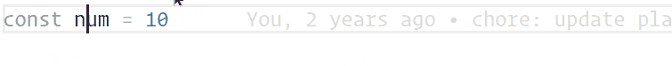

# Debugger for Console
Effortlessly generate console debugging information for various languages.

这个文档还有 [简体中文](./README-CN.md) 版本。

## BREAKING CHANGE
From version 0.11.0 onwards, replace the placeholder variable with {VALUE} instead of $.

## Why not [Turbo Console Log](https://marketplace.visualstudio.com/items?itemName=ChakrounAnas.turbo-console-log)?
First of all, I have to admit that it is really great, and even the motivation of my plug-in is because of it, but I did find some problems in use (maybe I was wrong😜).

1. Even if a single emoji can be replaced, Byt all statements can only appear in the console as the same emoji.
2. When multiple cursors are inserted, they are inserted in sequence, which may leave many modification records locally.
3. Cannot output different log messages from different file types in the current workspace.
4. Can't customize what you create. For example, sometimes I want to use `debugger` instead of `console.log`.
5. Creating multiple lines of cursor in the same line will create multiple statements, and the order is not guaranteed.
6. Occasionally I want a clean log output, but I don't want to create it manually.
7. ...

>! Let me reiterate that there is nothing wrong with it, but it can't meet my needs in some ways. If you have these problems, you might as well try this plugin, which is free anyway. 😇

If you think it works, you might as well give me a ⭐, which is my greatest encouragement. Thank you for your use~

## Features
1. Swiftly generate console debugging information across multiple languages.
2. Insert debugging statements before or after the current line.
3. Remove all debugging statements within the document.
4. Comment and uncomment all debugging statements in the document.
5. Insert debugging statements at multiple cursor locations.
6. Merge multiple cursors on the same line.
7. Hot update the latest workbench configuration.(without restarting your editor.)

## Installing

This extension is freely available in the [Visual Studio Code Marketplace](https://marketplace.visualstudio.com/items?itemName=banlify.debugger-for-console).

## Usage

### Keybindings
#### Create the statement before the line
<kbd>ctrl</kbd> + <kbd>shift</kbd> + <kbd>↑(ArrowUp)</kbd>



#### Create the statement after the line
<kbd>ctrl</kbd> + <kbd>shift</kbd> + <kbd>↓(ArrowDown)</kbd>


#### Remove all statements on document
<kbd>ctrl</kbd> + <kbd>shift</kbd> + <kbd>←(Backspace)</kbd>


#### Comment all statements on document
<kbd>ctrl</kbd> + <kbd>shift</kbd> + <kbd>/</kbd>


#### Uncomment all statements on document
<kbd>ctrl</kbd> + <kbd>shift</kbd> + <kbd>u</kbd>


#### Multi cursor
Insert at multiple line cursors:


Merge multiple cursors on the same line:


### command

> \> `debugger-for-console.create`: Insert a debug statement after the current line

> \> `debugger-for-console.before`: Insert a debug statement before the current line

> \> `debugger-for-console.remove`: Remove all debugger statements

> \> `debugger-for-console.comment`: Comment all debugger statements

> \> `debugger-for-console.uncomment`: Uncomment all debugger statements

> \> `debugger-for-console.update`: Update the latest workbench configuration. (This allows your modifications to take effect immediately without restarting your editor.)

> [!IMPORTANT]
> if you find that the indentation of the statement you created is incorrect, please check the indentation method and size configured in your current file or the whole project. The default of the plug-in is: 2 indented spaces.


## Configuration

You can personalize the statements you wish to insert via the Settings. (This plugin can also serve as a straightforward code snippet tool.)

```json5
// Default Settings
{
  // Automatically save the current file after executing an operation
  "debugger-for-console.autoSave": false,

  // Specify the type of quotation marks to use when inserting statements
  // Note: Some languages that require the use of double quotes may not support this feature, e.g., Go, C#, rust
  "debugger-for-console.quote": "'",

  // Whether or not whether to insert an emoji
  "debugger-for-console.emoji": true,

  // Set the relative path depth of files
  "debugger-for-console.fileDepth": 2,

  // Whether or not whether to insert the line number
  "debugger-for-console.lineNumber": true,

  // Insert scope symbols in the debug statement
  "debugger-for-console.symbols": false,

  // Show variables and logos in rows. (Very effective when the content is long.)
  "debugger-for-console.outputNewline": false,

  // Is it possible to output only one parameter.
  // The log output method in some languages does not support multiple functions, such as `Java`
  "debugger-for-console.onlyOutputVariable": "auto",

  // Whether to insert an empty line before or after the log message or not.
  "debugger-for-console.insertEmptyLine": "none",

  // Customize debugging statements for different languages
  "debugger-for-console.wrappers": {
    "php": "var_dump({VALUE})",
    "python": "print({VALUE})",
    "rust": "println!({VALUE})",
    "go": "println({VALUE})",
    "csharp": "Console.Log({VALUE})",
    // TIPS: The keys `javascript`, `typescript`, `javascriptreact`, `typescriptreact`, `vue`, and `svelte` all correspond to JavaScript.
    "javascript": "console.log({VALUE})",
    "default": "console.log({VALUE})"
  }
}
```

### examples

```json5
{
  "debugger-for-console.wrappers": {
    "javascript": "console.warn({VALUE})"
    // OR
    // "javascript": "debugger"
    // "javascript": "print({VALUE})"
  }
}
```


